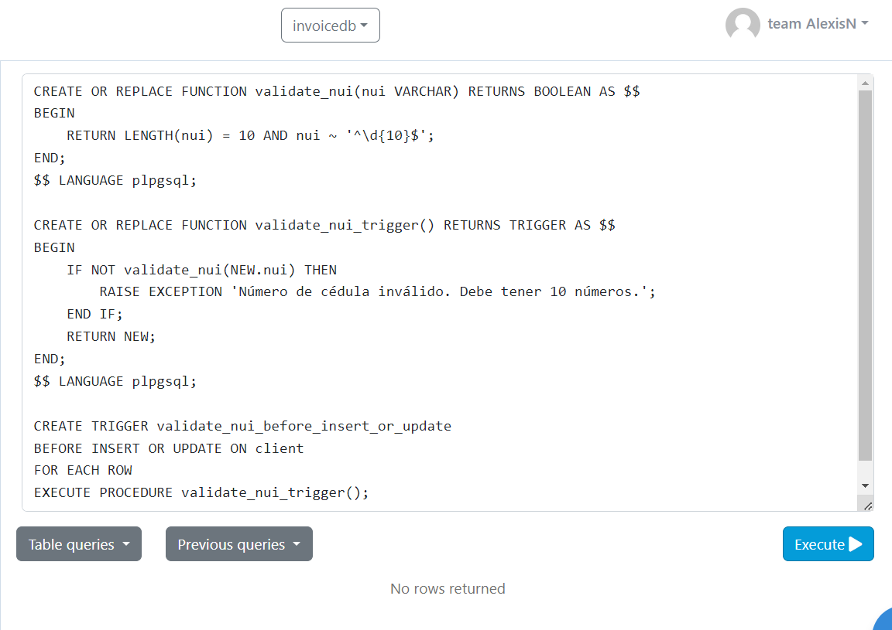
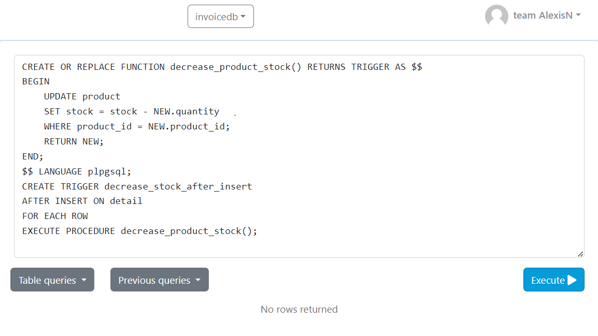
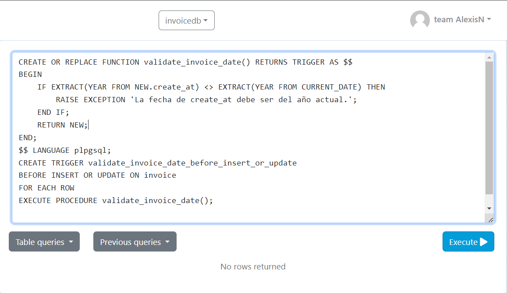
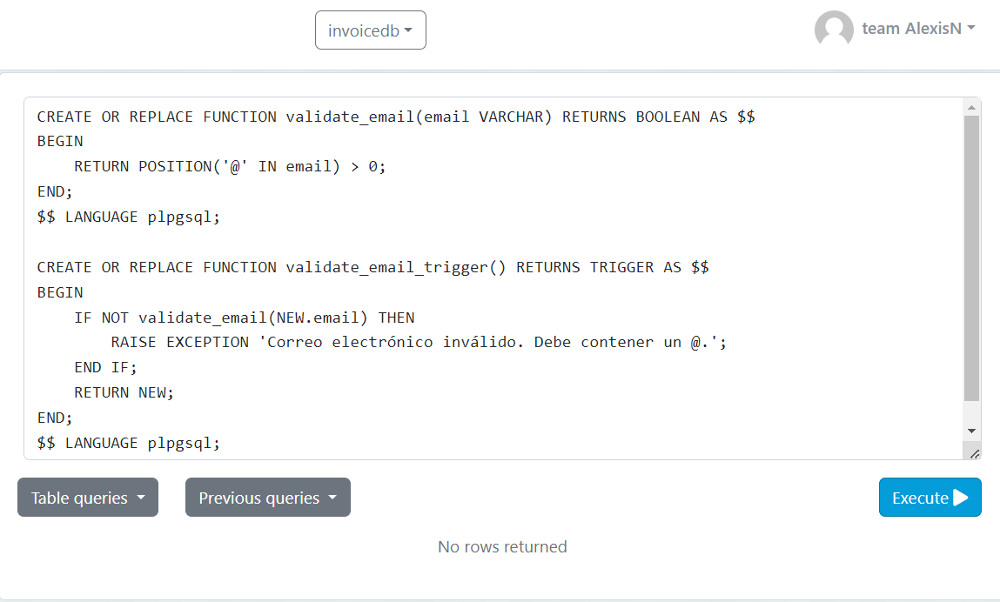

# TAS13 - CREAR TRIGGERS

### 1. - Crear un función y un trigger para validar que el numero de cedula del cliente tenga 10 números (no letras) en la tabla cliente.
---
- Sentencia:
```
CREATE OR REPLACE FUNCTION validate_nui(nui VARCHAR) RETURNS BOOLEAN AS $$
BEGIN
    RETURN LENGTH(nui) = 10 AND nui ~ '^\d{10}$';
END;
$$ LANGUAGE plpgsql;

CREATE OR REPLACE FUNCTION validate_nui_trigger() RETURNS TRIGGER AS $$
BEGIN
    IF NOT validate_nui(NEW.nui) THEN
        RAISE EXCEPTION 'Número de cédula inválido. Debe tener 10 números.';
    END IF;
    RETURN NEW;
END;
$$ LANGUAGE plpgsql;

CREATE TRIGGER validate_nui_before_insert_or_update
BEFORE INSERT OR UPDATE ON client
FOR EACH ROW
EXECUTE PROCEDURE validate_nui_trigger();

```

- Captura



### 2. - Crear un función y un trigger para que cada vez que se inserte un nuevo registro en la tabla item se disminuya el stock de la tabla product.
---
- Sentencia:
```
CREATE OR REPLACE FUNCTION decrease_product_stock() RETURNS TRIGGER AS $$
BEGIN
    UPDATE product
    SET stock = stock - NEW.quantity
    WHERE product_id = NEW.product_id;
    RETURN NEW;
END;
$$ LANGUAGE plpgsql;
CREATE TRIGGER decrease_stock_after_insert
AFTER INSERT ON detail
FOR EACH ROW
EXECUTE PROCEDURE decrease_product_stock();
```

- Captura



### 3. - Crear un función y un trigger para la tabla invoice donde valide que el campo create_at sea del año actual (fecha sistema).
---
- Sentencia:
```
CREATE OR REPLACE FUNCTION validate_invoice_date() RETURNS TRIGGER AS $$
BEGIN
    IF EXTRACT(YEAR FROM NEW.create_at) <> EXTRACT(YEAR FROM CURRENT_DATE) THEN
        RAISE EXCEPTION 'La fecha de create_at debe ser del año actual.';
    END IF;
    RETURN NEW;
END;
$$ LANGUAGE plpgsql;
CREATE TRIGGER validate_invoice_date_before_insert_or_update
BEFORE INSERT OR UPDATE ON invoice
FOR EACH ROW
EXECUTE PROCEDURE validate_invoice_date();

```

- Captura




### 4. - Crear un función y un trigger para la tabla client y validar que el correo tenga un @.
---
- Sentencia:
```
CREATE OR REPLACE FUNCTION validate_email(email VARCHAR) RETURNS BOOLEAN AS $$
BEGIN
    RETURN POSITION('@' IN email) > 0;
END;
$$ LANGUAGE plpgsql;

CREATE OR REPLACE FUNCTION validate_email_trigger() RETURNS TRIGGER AS $$
BEGIN
    IF NOT validate_email(NEW.email) THEN
        RAISE EXCEPTION 'Correo electrónico inválido. Debe contener un @.';
    END IF;
    RETURN NEW;
END;
$$ LANGUAGE plpgsql;
```

- Captura


